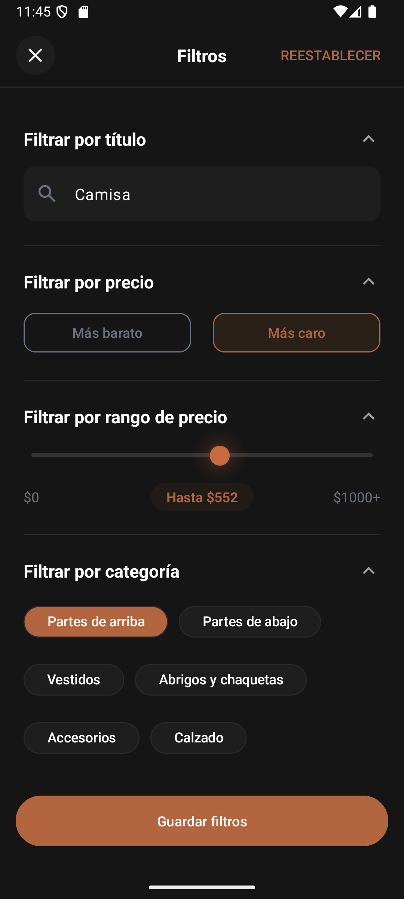

# MODU

[](https://kotlinlang.org/)
[](https://developer.android.com/about/versions/pie)

MODU is a native Android clothing-store application built to demonstrate a layered Kotlin architecture, reactive UI state, paginated catalog browsing, product variants, and a cart persisted with Room.

The project is actively being completed as a portfolio release. The Android client already contains the catalog, product detail, cart, and checkout flows; the FastAPI backend is currently a local mock exposed through an ephemeral tunnel. See [Project status](docs/project-status.md) for the verified scope, current limitations, and release work.

## Screenshots

<table>
  <tr>
    <td></td>
    <td></td>
    <td></td>
  </tr>
  <tr>
    <td></td>
    <td></td>
    <td></td>
  </tr>
</table>

## Highlights

- Browse a paginated product catalog with search and filters.
- Select product variants and quantities with stock validation.
- Persist cart items locally with Room, including add, update, delete, clear, and undo-delete actions.
- Reconcile pending cart changes with the remote cart when the app retries synchronization.
- Surface stock and price alerts returned during the simulated checkout flow.
- Model screen state with `StateFlow` and one-shot UI events with `SharedFlow`.
- Cover repository, use-case, and ViewModel behavior with JVM unit tests.

## Architecture

MODU separates presentation, domain, and data responsibilities, with Hilt composing the dependency graph.

```
Presentation
  Fragments (XML + ViewBinding) and ViewModels
  StateFlow for state, SharedFlow for one-shot events

Domain
  Use cases, entities, and repository contracts

Data
  Repository implementations, Retrofit remote sources, Room local sources
  DTO/domain mapping and centralized error mapping

Hilt
  Network, database, data, and domain modules
```

The catalog uses Paging 3. `ProductPagingSource` owns page-key mechanics in the data layer; the domain layer exposes `PagingData`, an intentional AndroidX Paging dependency. The cart repository combines local persistence, pending-change tracking, and remote reconciliation.

## Technology

| Technology | Use |
|---|---|
| Kotlin, Coroutines, Flow | Language and asynchronous state |
| Hilt | Dependency injection |
| Retrofit, OkHttp, Gson | HTTP and JSON serialization |
| Room | Local cart persistence |
| Paging 3 | Incremental catalog loading |
| ViewBinding and XML | UI implementation |
| Navigation Safe Args | Type-safe navigation |
| Coil | Image loading |
| JUnit, MockK, kotlinx-coroutines-test | JVM unit tests |

## Testing

The project has 56 JVM unit tests across repository, use-case, and ViewModel layers. They were last run successfully locally on 2026-07-11. Instrumented UI tests and clean-clone CI verification are not part of the current evidence.

## Run Locally

1. Clone the repository and open the `Project` directory in Android Studio.
2. Use JDK 21 (Android Studio's bundled JBR is suitable).
3. Configure `local.properties` with the local Android SDK path if Android Studio has not created it.
4. Run the `app` configuration on an emulator or device, or run the JVM test task from Android Studio.

The backend URL is currently defined in `app/build.gradle.kts` and points to an ephemeral FastAPI mock endpoint. A stable deployed backend and configuration-based URL management are planned before release.

## Demo Catalog Assets

The `demo` flavor opens the versioned prepackaged database at `app/src/demo/assets/database/modu_demo_database.db`. Regenerate catalog inputs from `Project/` when the source catalog changes:

```powershell
python scripts/catalog/prepare_catalog.py prepare `
  --source scripts/catalog/catalog-source.json `
  --assets app/src/demo/assets/catalog/images `
  --seed catalog-db-generator/src/main/resources/catalog/catalog-seed.json `
  --reports scripts/catalog/reports
```

Review the generated seed, images, and reports, then regenerate the database without path arguments:

```powershell
.\gradlew.bat :catalog-db-generator:generateDemoCatalogDatabase
```

The database, seed, and app images are versioned artifacts. `scripts/catalog/reports/` and `catalog-db-generator/build/` are local generated outputs.

## Links

- Android repository: https://github.com/JuanCarlosLF/modu-clothes-shop-android
- FastAPI backend: https://github.com/JuanCarlosLF/modu-clothes-shop-fastapi
- Architecture decisions: [docs/adr/ADRs.md](docs/adr/ADRs.md)
- Verified status and scope: [docs/project-status.md](docs/project-status.md)
