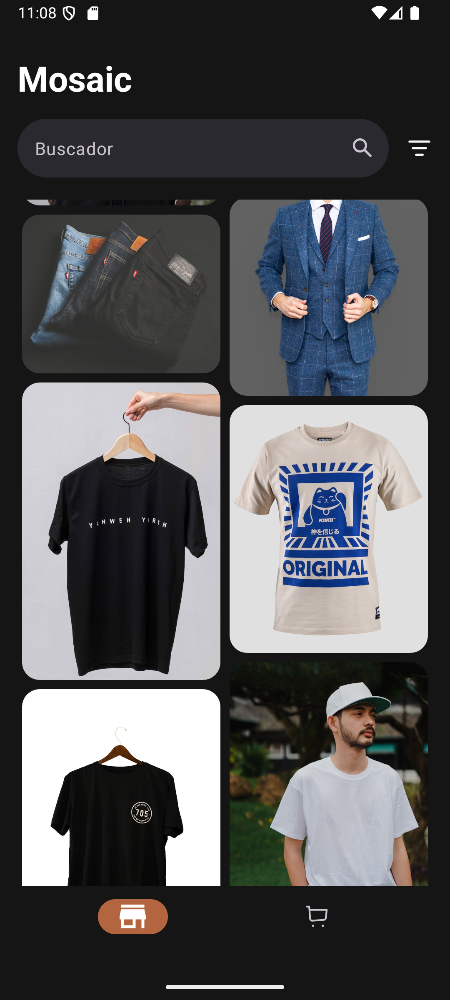
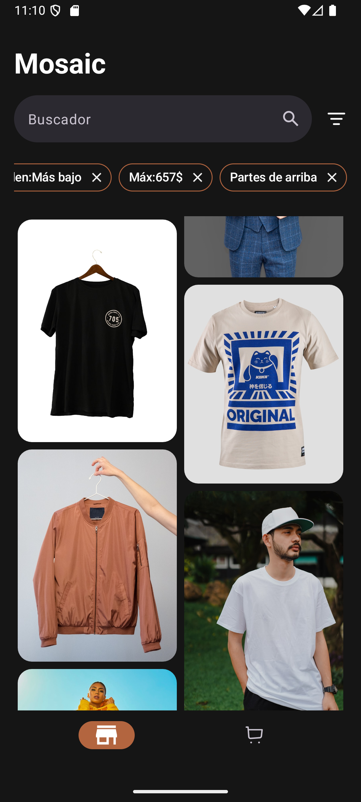
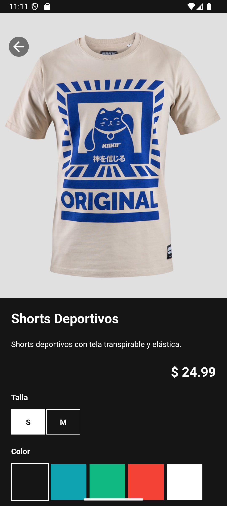
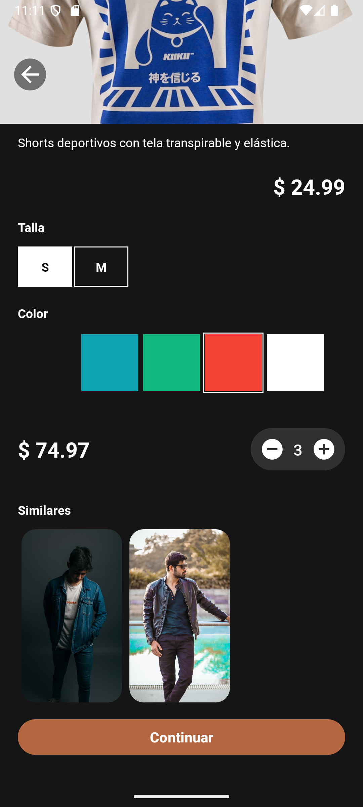
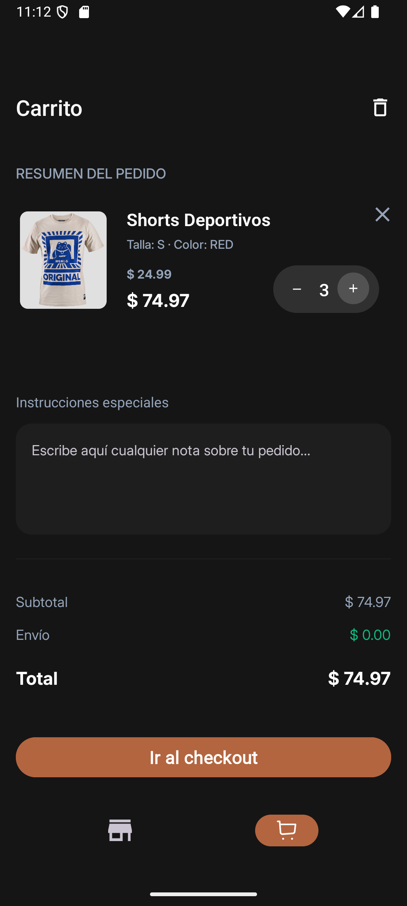

# MODU — Technical Documentation

[](https://kotlinlang.org/)
[](https://developer.android.com/about/versions/pie)
[](#)

## Table of Contents

- [Screenshots](#screenshots)
- [What It Does](#what-it-does)
- [Tech Stack & Architecture](#tech-stack--architecture)
- [Key Technical Decisions](#key-technical-decisions)
- [Testing](#testing)
- [Roadmap](#roadmap)
- [Setup & Build](#setup--build)

## Screenshots

<table>
  <tr>
    <td></td>
    <td></td>
  </tr>
  <tr>
    <td></td>
    <td></td>
  </tr>
  <tr>
    <td></td>
    <td></td>
  </tr>
</table>

---

## What It Does

MODU implements a clothing store experience on Android. The core flows are:

- **Product catalog** — browsing with filtering, search, and paginated results. The backend exposes a `page`/`size` API, and the app uses Paging 3 to load data incrementally, keeping memory usage predictable even with large catalogs.
- **Product detail** — individual product view with related item suggestions.
- **Shopping cart with offline-first persistence** — cart items are stored locally using Room. When the network is available, pending changes sync to the server. When it is not, the user can still browse, add items, and modify quantities. The app handles price and stock alerts returned by the backend during checkout, distinguishing between a completed order and a warning that requires user attention.
- **Multi-device cart synchronization** — the local-first approach keeps the cart consistent across sessions, with sync logic that merges remote and local state when connectivity resumes.

The offline-first design was driven by backend instability during development. Rather than blocking the cart flow on unreliable network responses, the app stores changes locally and retries synchronization — a pragmatic choice that turned out to be a valuable architecture exercise.

---

## Tech Stack & Architecture

### Architecture

MODU follows Clean Architecture with four layers:

```
┌─────────────────────────────────────────────────┐
│                 Presentation                     │
│   ViewModels (StateFlow)  ←  XML layouts        │
├─────────────────────────────────────────────────┤
│                  Domain                          │
│   Use Cases  ←  Business logic (no Android dep) │
├─────────────────────────────────────────────────┤
│                   Data                           │
│   Repositories  ←  Remote + Local sources       │
│   DTO → Domain mapping  ←  Error handling       │
├─────────────────────────────────────────────────┤
│                     DI                           │
│   Hilt modules: Network, Data, Domain, Database  │
└─────────────────────────────────────────────────┘
```

- **Data** — repositories, data sources (remote and local), DTO-to-domain mapping. `CartRepositoryImpl` manages offline persistence, pending sync, and remote merging. `ProductRepositoryImpl` handles paginated catalog fetching.
- **Domain** — use cases and business logic. `CartUseCaseImpl` validates quantities and encapsulates cart operations. `ProductUseCaseImpl` coordinates catalog queries. No Android or framework dependencies.
- **Presentation** — ViewModels and UI. `HomeViewModel` composes search filters with `flatMapLatest` and `cachedIn`. `CartViewModel` manages UI events (success, offline, clear-cart).
- **DI** — Hilt modules wiring everything: `NetworkModule` (Retrofit/OkHttp), `DataModule` (repositories, error handler), `DomainModule` (use cases), `DatabaseModule` (Room DAO).

### Stack

| Technology | Purpose |
|---|---|
| Kotlin + Coroutines/Flow | Language and async model. Coroutines handle background work; Flow provides reactive data streams. |
| Hilt | Dependency injection. Clean decoupling between layers. |
| Retrofit + OkHttp + Gson | Networking stack. API contract, HTTP mechanics, JSON serialization. |
| Room | Local persistence with compile-time SQL validation. Powers the offline-first cart. |
| StateFlow/SharedFlow | Reactive state management. Chosen over LiveData for Kotlin ecosystem fit and testability. |
| Paging 3 | Catalog pagination. `PagingSource` encapsulates page/key logic in the data layer. |
| ViewBinding + XML | Current UI layer. Migration to Jetpack Compose is planned. |
| Navigation Safe Args | Type-safe navigation between screens. |
| Coil | Image loading optimized for Android. |
| JUnit + MockK + kotlinx-coroutines-test | Unit test framework and libraries. JUnit runs the tests, MockK handles mocking, kotlinx-coroutines-test handles async. |

---

## Key Technical Decisions

| Decision | Why | Trade-off |
|---|---|---|
| **StateFlow over LiveData** | Belongs to Kotlin coroutines ecosystem, not tied to Android Lifecycle. Easier to test (no LiveData test observers). | No built-in lifecycle awareness — UI must handle subscription timing manually. |
| **Paging 3 over manual pagination** | `PagingSource` abstraction keeps page/key logic in the data layer. Cleaner, more maintainable code. | Domain layer depends on `PagingData` from AndroidX — acceptable coupling for the benefit. |
| **Offline-first cart sync** | Backend was unstable during development. Local-first approach keeps the cart functional regardless of network state. | Sync logic is complex (merging remote/local, handling stale data, processing alerts). Future: WorkManager for background retries. |
| **ErrorHandler as injectable interface** | Centralizes error mapping (IO/HTTP → domain `AppError`). Follows team convention, easy to mock in tests. | Adds an abstraction layer, but consistent error handling across the app justifies it. |
| **Planned: Compose migration** | Compose is the current Android UI standard. Better maintainability, simpler reusable components, state-driven composition. | Migration requires rewriting UI code and learning the Compose mental model. |

> For detailed decision records, see the ADR directory.

---

## Testing

MODU includes a unit test suite built with JUnit, MockK, and kotlinx-coroutines-test. Tests cover the repository, use case, and ViewModel layers — the three points where business logic and state management intersect.

| Test File | What It Covers |
|---|---|
| `CartRepositoryImplTest` | Add, update, sync, checkout, offline behavior, error handling |
| `CartUseCaseImplTest` | Quantity validation, total calculation, early return conditions |
| `HomeViewModelTest` | Search filter updates propagate correctly |
| `CartViewModelTest` | Quantity updates, error events, cart clearing, checkout outcomes |
| `DetailViewModelTest` | Product detail loading, quantity limits, cart event emission |

The test suite focuses on logic correctness rather than UI rendering. Instrumented and UI tests are not yet in place — this is a known gap addressed in the roadmap.

---

## Roadmap

- [ ] **Migrate UI to Jetpack Compose** — Modernize from XML/ViewBinding for better maintainability and state-driven UI
- [ ] **Modularize with Gradle modules** — Evolve from package-based separation to proper Gradle modules for build performance and dependency boundaries
- [ ] **Replace DeviceId auth with token-based authentication** — Move from anonymous device identity to a proper user auth system
- [ ] **Unify ViewModel state exposure** — Consolidate separate state flows into a single cohesive `UiState` per screen
- [ ] **Add instrumented/UI tests** — Expand test coverage beyond unit tests to validate end-to-end user flows

---

## Setup & Build

1. **Clone the repository:**
   ```bash
   git clone https://github.com/juan-carlos-lopez-dev/MODU.git
   ```
2. **Open in Android Studio:** Select the root folder and wait for Gradle sync to finish.
3. **Gradle version:** 9.1.0 (managed by wrapper)
4. **JDK:** 21
5. **Configure local SDK:** Ensure `local.properties` points to your SDK:
   ```properties
   sdk.dir=C\:\\Users\\<your-user>\\AppData\\Local\\Android\\Sdk
   ```
6. **Run:** Press `Shift + F10` or the **Run** icon in Android Studio.


