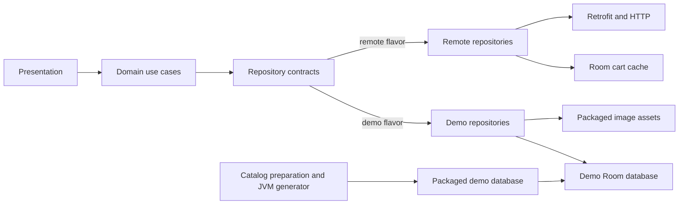

# Architecture

## Overview

MODU is a native Android client organized around shared presentation and domain code with flavor-selected data implementations. The application owns screen rendering, catalog browsing, cart state, and client-side persistence. The `demo` flavor serves the experience entirely from packaged assets and local Room data; the `remote` flavor retains the REST-backed client path.

This document explains how MODU is currently structured. The [architecture decision records](adr/ADRs.md) explain why key choices were made.

## Modules And Source Sets

The Gradle build in `Project/` contains two modules:

- `app` is the Android application. `app/src/main` contains the shared XML/ViewBinding UI, domain contracts and use cases, remote data classes, common cart persistence, and common Hilt modules. `app/src/demo` adds the local catalog/cart implementation and its Hilt bindings. `app/src/remote` adds the network graph, remote repository bindings, flavor-specific base URL, and manifest permission.
- `catalog-db-generator` is a Kotlin/JVM tool. It reads the exported Room schema, normalized catalog seed, and prepared images, then writes the database packaged by the demo application.

The application test source sets are `test`, `testDemo`, `androidTest`, and `androidTestDemo`. `scripts/catalog` contains Python catalog preparation and regression tooling; it is not a Gradle module.

## Layers And Composition

### Presentation

`MainActivity` hosts Navigation fragments. Fragments render XML layouts through ViewBinding, delegate user actions to Hilt ViewModels, and adapt domain models for RecyclerView and Paging adapters. ViewModels own screen state, launch coroutine work, and call domain use cases.

### Domain

Domain entities, `ProductUseCase` and `CartUseCase`, and the `ProductRepository` and `CartRepository` contracts live in the shared `main` source set. Use cases apply interaction rules such as cart quantity limits and otherwise delegate to repository contracts. Catalog contracts expose `Flow<PagingData<Product>>`, so AndroidX Paging intentionally crosses the domain boundary.

### Data

Repositories coordinate data sources and map Room or Retrofit models to domain entities. The demo repositories read and mutate the demo Room database. The remote product repository pages Retrofit responses, while the remote cart repository coordinates HTTP operations, Room persistence, and synchronization preferences.

### Hilt

Shared Hilt modules provide the domain use cases, error handling, and common cart database dependencies. Flavor modules bind the same repository contracts to either `DemoProductRepositoryImpl` and `DemoCartRepositoryImpl`, or `ProductRepositoryImpl` and `CartRepositoryImpl`. The remote-only network module provides OkHttp, Retrofit, and the product and cart APIs.

## Flavor Composition

- `demo` is the ready-to-run local implementation. `DemoDatabaseModule` opens `app/src/demo/assets/database/modu_demo_database.db` with Room `createFromAsset`; the same `ModuDemoDatabase` exposes product and cart DAOs. Catalog images are packaged under `app/src/demo/assets/catalog/images` and mapped to Android asset URIs.
- `remote` preserves the REST implementation. Its Hilt graph configures Retrofit from the flavor's `BuildConfig.BASE_URL` and selects the remote repositories. The project declares `android.permission.INTERNET` only in `app/src/remote/AndroidManifest.xml`; the shared and demo manifests do not declare it.

## Catalog Data Flow

The home screen converts search and filter state into a `ProductUseCase` request. Both repository implementations create a Paging 3 `Pager`, map records to domain `Product` values, and expose `PagingData` to `HomeViewModel`. The ViewModel caches the stream in its scope, and `HomeFragment` submits it to a `PagingDataAdapter` while observing load state.

In `demo`, `ProductDao` supplies a Room `PagingSource` whose SQL applies title, maximum-price, category, and price-order filters. The same DAO returns categories, product details with variants, and related products from the prepackaged database. The database is generated before packaging; it is not seeded or imported at runtime.

In `remote`, `ProductPagingSource` requests zero-based pages through `ProductApi`, passes the Paging load size to the request, and advances while the response metadata reports another page. Detail, category, and related-product reads use the same remote product data source.

## Cart And Checkout Data Flow

The shared cart use case validates quantities and exposes the repository's cart `Flow` to `CartViewModel`.

In `demo`, `DemoCartRepositoryImpl` stores cart rows in `ModuDemoDatabase`. Its cart DAO joins cart items to the packaged product and variant rows and emits updates as a Room `Flow`. Adding an existing variant combines quantities up to available stock. Checkout is a local simulation: it clears the cart and returns success without processing payment or creating an order.

In `remote`, `CartRepositoryImpl` exposes the separate `CartDatabase` as the observable local cart and coordinates it with `CartApi`. Local quantity changes are marked for synchronization, offline additions use negative identifiers, and reconciliation updates existing server items before adding local-only items. Server responses replace local cart state and preserve price, stock, and availability alerts. A successful checkout clears local state; a response that does not place an order stores the returned cart and reports that alerts were triggered. See the historical integration document for endpoint-level behavior.

## State And Events

ViewModels expose durable screen state through read-only `StateFlow`. Catalog filters drive a new Paging stream with `flatMapLatest`, and cart state is derived from the repository's Room-backed flow. Cart and product-detail ViewModels use `SharedFlow` for one-off UI events such as dialogs, toasts, and checkout feedback.

Fragments collect state, events, Paging data, and load state from `viewLifecycleOwner.lifecycleScope` inside `repeatOnLifecycle(Lifecycle.State.STARTED)`, tying collection to the Fragment view lifecycle.

## Testing Strategy

- `app/src/test` contains JVM tests for shared ViewModels, cart use-case rules, remote cart repository behavior, and DTO reconciliation, using JUnit, coroutine test utilities, and MockK.
- `app/src/testDemo` exercises demo repository behavior independently of Android framework storage.
- `app/src/androidTest` verifies application identity on an Android runtime.
- `app/src/androidTestDemo` exercises the demo Room DAOs, catalog relationships and filters, cart persistence, and opening the packaged database on a device or emulator.
- `catalog-db-generator/src/test` verifies parsing, validation, SQLite writing, and generator behavior on the JVM.
- `scripts/catalog/test_prepare_catalog.py` covers the Python preparation pipeline with `unittest`.

## Related Documentation

- [Architecture decision records](adr/ADRs.md)
- [Demo catalog generation](catalog-generation.md)
- [Historical REST integration](historical-rest-integration.md)
